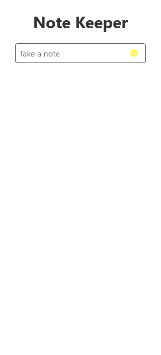
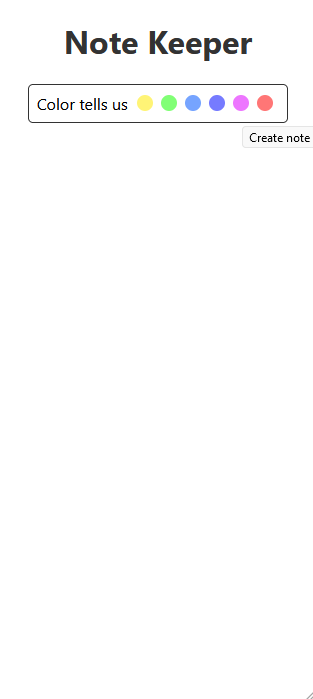
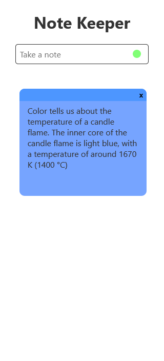
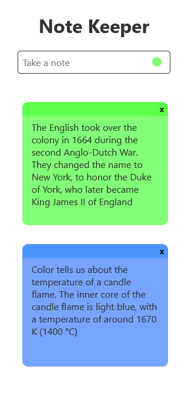
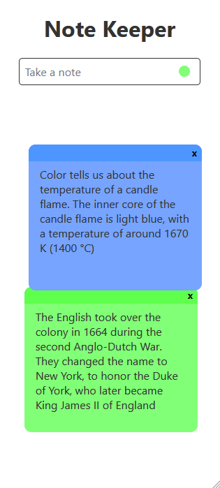
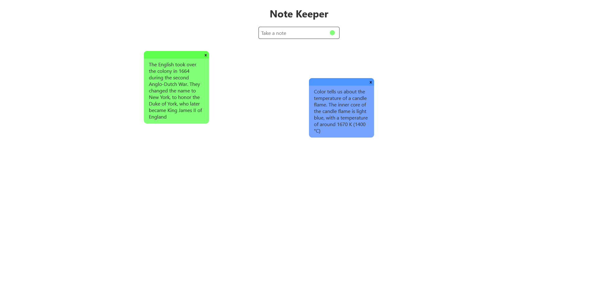
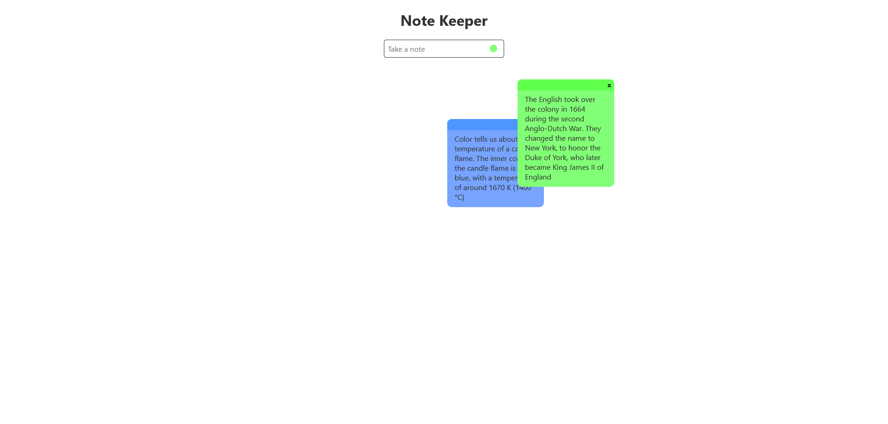
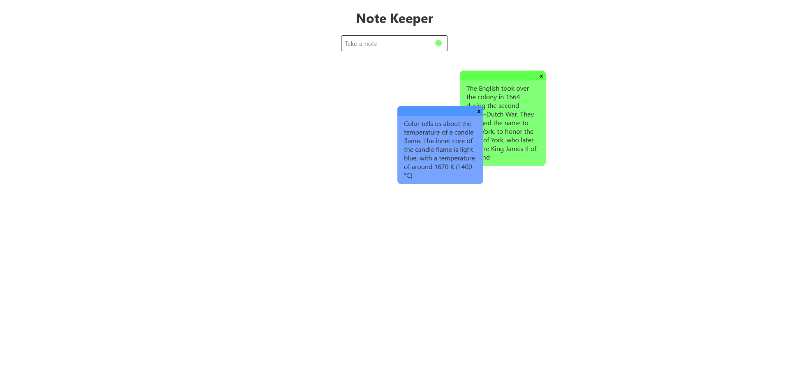
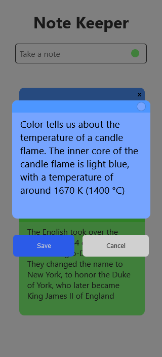
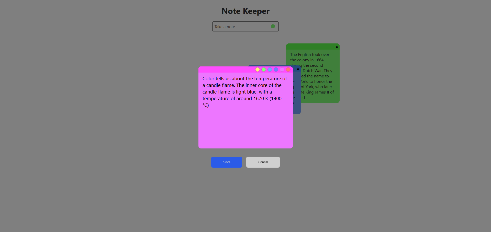

# note-keeper

Web app for keeping notes.

## Table of Contents
1. [Goals](#goals)
2. [Technologies Used](#technologies-used)
3. [Project Setup](#project-setup)
4. [Screenshots](#here-are-some-screenshots-of-the-app)

## Goals
I made this project to learn about unit testing and TDD: test-driven development.  The scope was intended to be small in order to finish the project in a reasonable amount of time.

## Technologies Used
* React - My framework of choice.

* TypeScript - I use TypeScript for my projects.

* Redux - For managing application state and applying middleware to save notes to local storage.

* React Testing Library - The testing framework for Create Reat App.

* React Beautiful DnD - The drag and drop library for mobile sizes.  I chose it for easy setup for vertical lists.

* React Draggable - The dragging library for large screen sizes.  Chosen for its stateful dragging functionality.  The exact position of each note is saved along with the rest of the note data.

* SCSS

* Color - A library I used to automate colors for the note headers and some buttons.

## Project Setup

### Clone

```bash
$ git clone https://github.com/Android789515/react-clock.git
```

### Install

```bash
$ npm install
```

### Development

```bash
$ npm run dev
```

### Build

```bash
$ npm run build
```

## Here are some screenshots of the app

### Mobile


## Creating a note


### Notes




### Re-ordering notes



### Large screen



### Dragging notes



### The active note will show above others



### When editing a note




